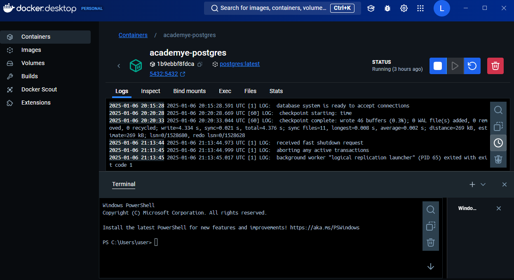
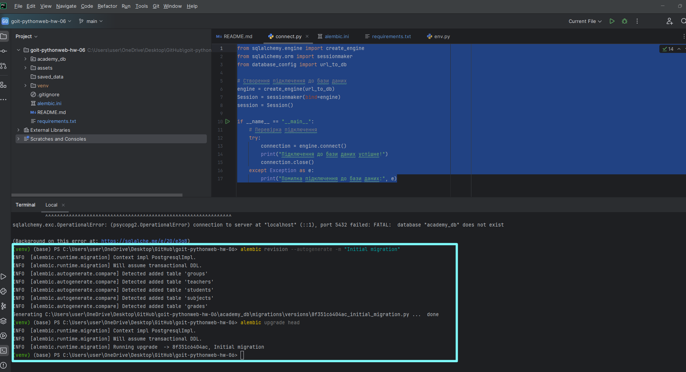
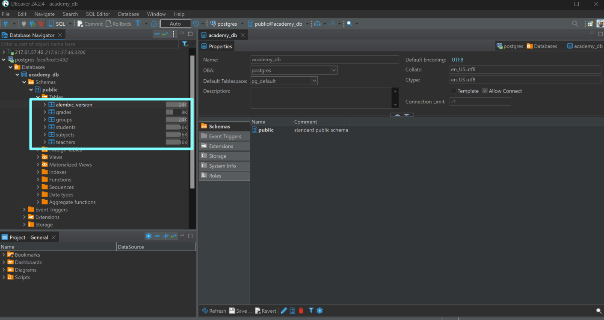
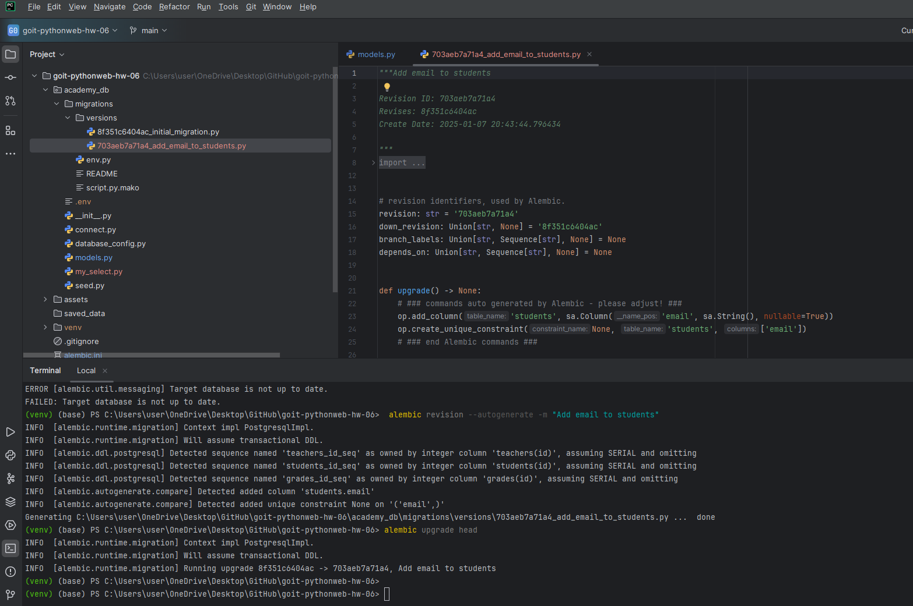
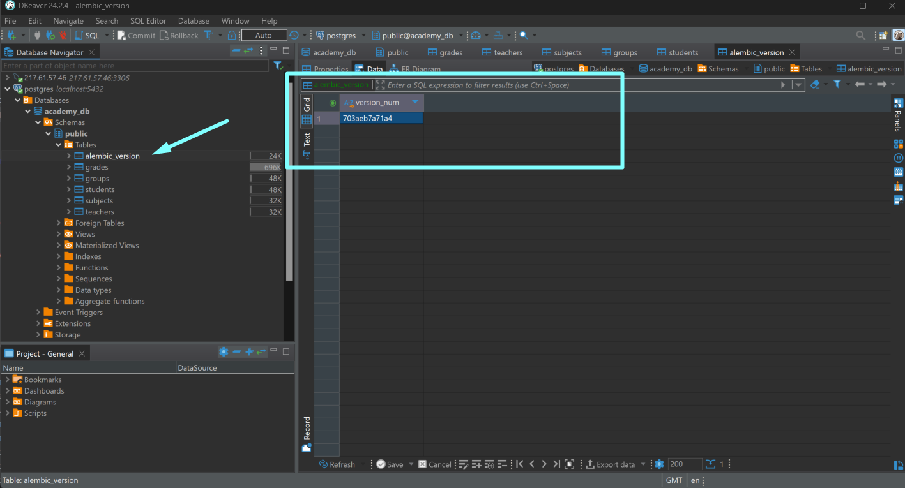
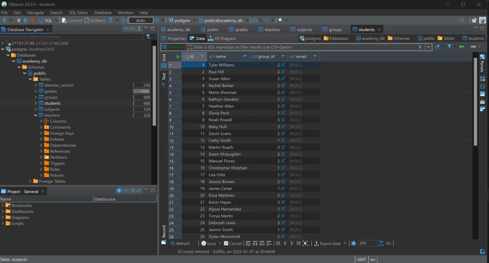
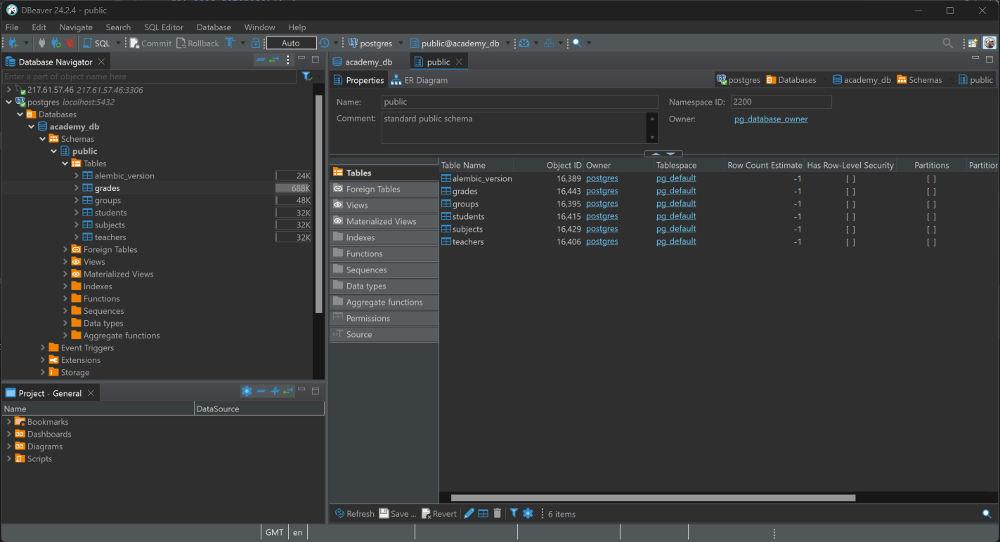
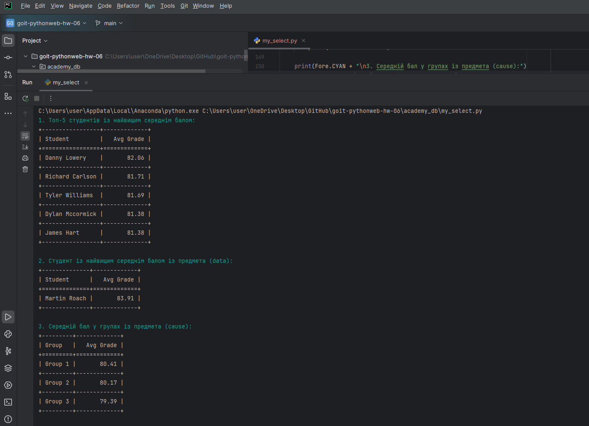
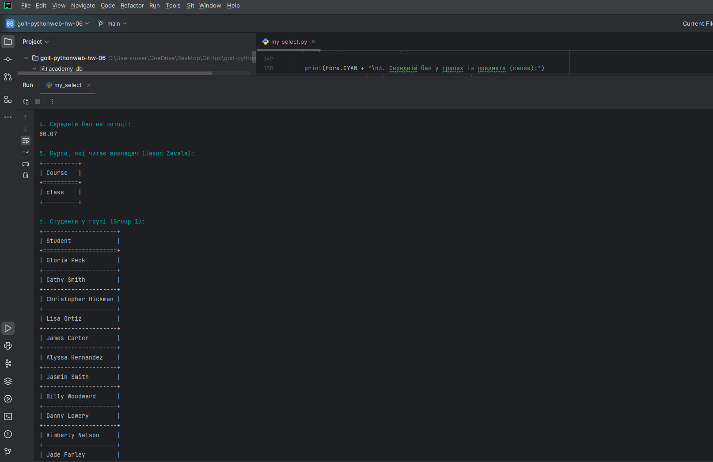
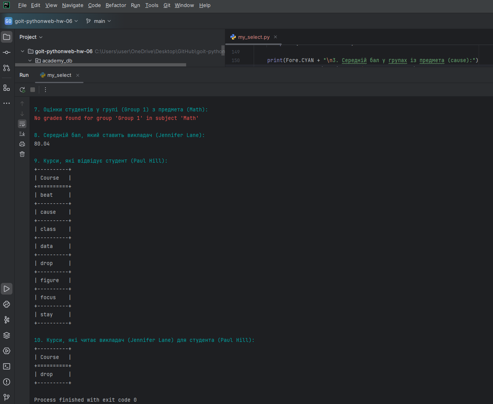

# Topic 6. Homework | SQLAlchemy | Database Schema Migrations | Alembic

## Task: Implement a database with the following schema:  

- A table for students;  
- A table for groups;  
- A table for teachers;  
- A table for subjects with a reference to the teacher responsible for the subject;  
- A table for student grades, specifying the date the grade was received.  

### Instructions  

#### Database Setup  

For this homework, we will use a PostgreSQL database. Run the following command 
to start a Docker container:  

```bash  
docker run --name some-postgres -p 5432:5432 -e POSTGRES_PASSWORD=mysecretpassword -d postgres  
```

Replace `some-postgres` with your container name and `mysecretpassword` with your 
custom password for connecting to the database.

---
## Technical Task Description

### Step 1

#### Implement SQLAlchemy models for the following tables:

- Students table;
- Groups table;
- Teachers table;
- Subjects table (with a reference to the teacher);
- Grades table (where each student has grades for subjects, with a date for each grade).

---
### Step 2

#### Use Alembic to create migrations for the database schema.

---
### Step 3

#### Create a script seed.py to populate the database with random data:

- ~30–50 students;
- 3 groups;
- 5–8 subjects;
- 3–5 teachers;
- Up to 20 grades for each student across all subjects.

Use the `Faker` package for generating random data. 
Populate the database using SQLAlchemy sessions.

---
### Step 4

#### Perform the following queries on the populated database:

1. Find the top 5 students with the highest average grade across all subjects. 
2. Find the student with the highest average grade in a specific subject.
3. Find the average grade for groups in a specific subject.
4. Find the overall average grade across all grades.
5. Find the courses taught by a specific teacher.
6. Get the list of students in a specific group.**  
7. Get the grades of students in a specific group for a specific subject.**  
8. Find the average grade given by a specific teacher across their subjects.**  
9. Get the list of courses attended by a specific student.**  
10. List the courses taught to a specific student by a specific teacher.** 

Для запитів оформити окремий файл `my_select.py`, де будуть 10 функцій від 
`select_1` до `select_10`. При запитах використовуємо механізм сесій `SQLAlchemy`.

------

# TASK RESULTS
#### 1. Start `docker postgres container`


#### 2. Initial migration with `alembic`



#### 2a. Add new column - student's email - migration with `alembic`




#### 3. Database populated with the random data using `Faker`


#### 4. Results of the requested queries




